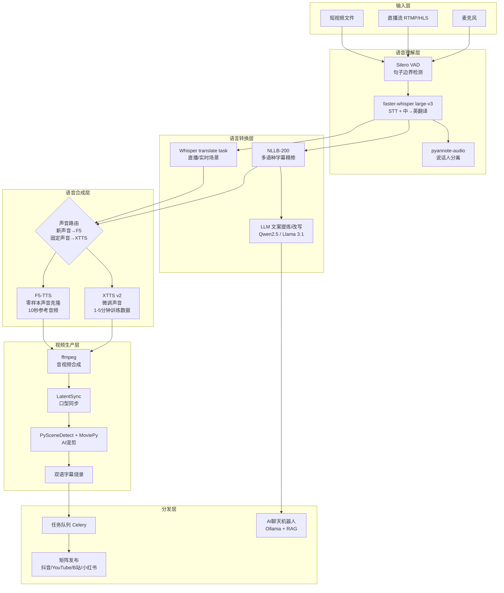

# 系统架构图

## 整体架构（Mermaid）



---

## 数据流说明

### 短视频翻译流程
```
视频文件
  → 提取音轨（ffmpeg）
  → VAD 切句
  → faster-whisper（转录 + 翻译）
  → 字幕时间轴对齐
  → F5-TTS / XTTS 合成目标语言语音
  → LatentSync 口型同步（可选）
  → ffmpeg 合成输出视频
  → 矩阵发布
```

### 直播同声传译流程
```
直播音频流
  → Silero VAD（实时切句，~300ms延迟）
  → faster-whisper streaming（~500ms）
  → F5-TTS 流式合成（首包~200ms）
  → 实时混流输出
  总延迟目标：< 2秒
```

### 声音克隆工作流
```
新声音需求
  → 录制/获取 10秒参考音频
  → F5-TTS 零样本注册（立即可用）
  ↓（可选，后台异步）
  → 收集 1-5 分钟干净录音
  → XTTS v2 微调（GPU，约2-4小时）
  → 替换为微调模型，质量提升
```

---

## 模块依赖关系

```
核心依赖（必须）：
  faster-whisper → 所有语音输入场景
  F5-TTS → 所有语音输出场景
  ffmpeg → 所有视频处理场景
  Silero VAD → 所有实时场景

可选增强：
  LatentSync → 真人出镜视频口型同步
  XTTS v2 → 高频声音微调
  NLLB-200 → 非英语目标语言
  pyannote-audio → 多人对话场景
  Ollama + LLM → AI聊天 + 文案改写
```

---

## 部署拓扑（单机方案）

```
┌─────────────────────────────────────────┐
│              GPU 服务器                   │
│                                         │
│  ┌──────────┐  ┌──────────┐  ┌───────┐ │
│  │ Whisper  │  │  F5-TTS  │  │ XTTS  │ │
│  │ Service  │  │ Service  │  │Service│ │
│  │ :8001    │  │ :8002    │  │ :8003 │ │
│  └──────────┘  └──────────┘  └───────┘ │
│                                         │
│  ┌──────────────────────────────────┐   │
│  │     Celery Worker (任务队列)      │   │
│  └──────────────────────────────────┘   │
│                                         │
│  ┌──────────────────────────────────┐   │
│  │     FastAPI 主服务 :8000          │   │
│  └──────────────────────────────────┘   │
└─────────────────────────────────────────┘
```
